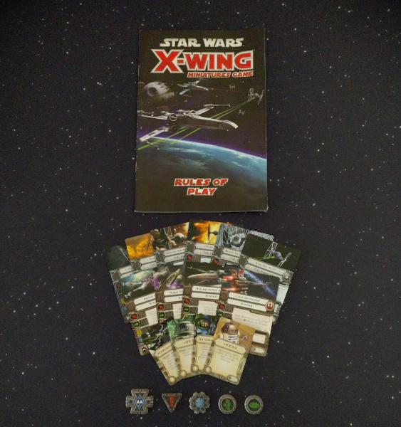
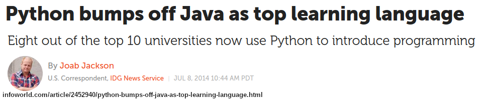
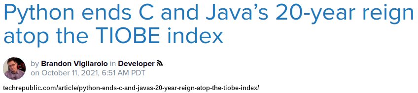

Title: Feature Creep vs Easy On-Ramp
Date: 2022-09-02 9:00
Category: Python
Tags: learners, analogies
Slug: feature-creep-vs-easy-onramp
Authors: Ben Denham (with Grant Paton-Simpson)
Summary: Experience with the X-Wing Miniatures Game provides a lesson for the Python community.
         We need to find a way to strip things back so it is easier (again) for beginners to learn the language.

Learning Python
---------------

Python has a deep heritage as a learning language.  The creator of
Python, Guido van Rossum, worked for several years on
[ABC](https://en.wikipedia.org/wiki/ABC_(programming_language)) which
was intended for teaching and prototyping.  Python was born out of
that context (see [History and Philosophy of Python: Easy as
ABC](https://python-course.eu/python-tutorial/history-and-philosophy-of-python.php))
and learnability is baked into its DNA.

As we were developing the ideas that would lead to the When of Python,
we started thinking about whether Python was still as easy to learn as
it used to be, given there is now often more than "one obvious way" to
do things. We also wondered whether having a variety options for how
to approach a task was necessarily a bad thing; it provides greater
flexibility to the user after all.

This got me thinking about my experience with the X-Wing Miniatures Game...

The X-Wing Miniatures Game
--------------------------

A few years ago I started playing the X-Wing Miniatures Game. Compared
to similar games, the simplicity of the game was a major drawcard,
because it meant that I could easily teach my friends how to play!
Instead of having a hardback rulebook with hundreds of pages, all you
needed to get going was a lightweight rules pamphlet and a handful of
cards and tokens:

Like many games, over time they released new expansions to provide new
possibilities for your squadron. Not only did each expansion add a new
ship to the game, but they also added new pilot abilities, ship
upgrades, and game mechanics:

Each new expansion was a welcome addition for veteran players, as it
helped keep the game fresh and exciting. However, after a few years of
expansions, the sheer volume of added rules had created a steep
learning curve that made the game unapproachable to beginners:

In the end, the game designers had to release a second edition to
drastically simplify the game because it had simply become too
complex:

> "...it got more complicated, making it less easy to jump into the proverbial cockpit."
>   [Fantasy Flight Games Hits Lightspeed with X-Wing Second Edition](https://www.starwars.com/news/x-wing-second-edition)

Releasing a second edition was no small endeavour: every player had to
replace all of their existing cards and tokens with updated versions.

Learnability
------------

Like X-Wing, learnability has been a big part of Python's
success. Python recently surpassed Java as the top learning language
in universities:

That success has been attributed to its simplicity:

> Python possesses a mix of qualities that makes it a good candidate for universities. It has a simpler syntax than Java or C++, allowing novices to start writing programs almost immediately.
>  [Python bumps off Java as top learning language - Eight out of the top 10 universities now use Python to introduce programming - Joab Jackson](https://www.infoworld.com/article/2452940/python-bumps-off-java-as-top-learning-language.html)

And just last year, Python became the most popular language on the
TIOBE index:

Again, simplicity is arguably a major factor in that
success:

> "Python, which started as a simple scripting language, as an alternative to Perl, has become mature. Its ease of learning, its huge amount of libraries and its widespread use in all kinds of domains, has made it the most popular programming language of today," said TIOBE CEO Paul Jansen.
>  [Python ends C and Java’s 20-year reign atop the TIOBE index - Brandon Vigliarolo](https://www.techrepublic.com/article/python-ends-c-and-javas-20-year-reign-atop-the-tiobe-index/)

Threats to Python's Learnability
--------------------------------

But how easy is it really to learn modern Python?  In order to
confidently read code, we have to be familar with all the language
features that we're likely to come across, Consider how much more
needs to be at least mentioned in a Python crash-course today compared
to just 10 years ago. We now have type hinting, f-strings, the
wonderfully-named walrus operator (`:=`), positional-only parameters,
and structural pattern matching (`match`). And that's just what's been
added in the last 10 years!

With so much more to learn, Python risks becoming unapproachable to
beginners, especially those who aren't full-time software engineers,
such as scientists, school teachers, and data analysts.

By alienating those users that have made Python so widespread,
Python's language creep could ultimately threaten its popularity.

The When of Python
------------------

Guidance on when to use Python features, and when not to, could
radically simplify the task of learning (and teaching) Python. The
When of Python could achieve this by eventually capturing a community
consensus on the features to associate with **Common Python**,
**Situational Python**, and **Deprecated Python**. In short, the When
of Python could help Python remain true to its teaching language
roots, which have been such a crucial ingredient in its huge success
to date, and hopefully will remain so!
