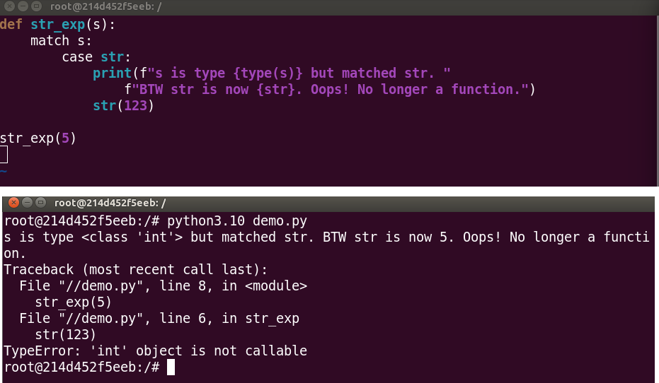
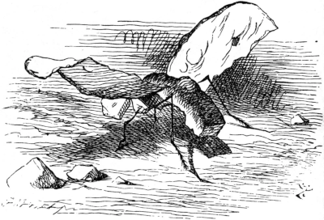

Title: Match Case - A Simple Switch Statement for Python?
Date: 2022-10-05 07:00
Category: Python
Tags: match case, structural pattern matching
Slug: simple-switch-statement-for-python
Authors: Grant Paton-Simpson
Summary: At first glance, match case (Structural Pattern Matching) looks like a simple switch statement for Python. Unfortunately, match case is a mini-language that is unsafe to use apart from the very narrow cases where its benefits outweigh its costs / risks.

What has your experience of match case (Structural Pattern Matching) been? Do you agree with this post? Do you disagree? Please comment below.

Simple Switch Statement at Last?
================================

Python has always lacked a `switch` statement to perform conditional logic e.g.

```python
## Note - not actual Python
case foo:
    when eggs:
        return 'spam'
    when knights:
        return 'Ni!'
    ...
```

The switch approach can be found in languages like PHP and also in SQL (`CASE` `WHEN` `THEN` `END` etc).

Instead, Python has relied largely on `if`-`elif`-`else` constructs and, to a lesser extent, dictionaries - for example:

```python
mapper = {'eggs': 'spam', 'knights': 'Ni!', ...}
result = mapper['eggs']
```

In Python 3.10, Structural Pattern Matching (match case) was added which raised some questions. Was this basically a switch statement on steroids? Should we all start using this for our conditional logic? And could it be time to largely retire `if`-`elif`-`else` constructs? Initial impressions were positive. Certainly the higher level syntax for Structural Pattern Matching looks clean and elegant:

```python
match food:
    case 'eggs':
        return 'spam'
    case ...
```

Unfortunately major concerns arise when we take a closer look.

Python Pattern Matching Problems
================================

New Mini Language
-----------------

Structural Pattern Matching is a new mini language in Python - a powerful language that looks like normal Python but isn't. And that is where the main gotchas come from.

Similarity to Object Instantiation Misleading
---------------------------------------------

Imagine we have a `Point` class:

```python
class Point:
    def __init__(self, x, y):
        pass
```

`case Point(x, y):` seems to me to be an obvious way of looking for such a `Point` object and unpacking its values into `x` and `y` but it isn't allowed. It is a perfectly valid syntax for instantiating a `Point` object but we are not instantiating an object and supplying the object the case condition – instead we are supplying a pattern to be matched and unpacked. We have to have a firm grasp on the notion that Python patterns are not objects. If we forget we get a `TypeError`:

```python
case Point(0, 999):

## TypeError: Point() accepts 0 positional sub-patterns (2 given)
```

Note, we must match the parameter names (the left side) but can unpack to any variable names we like (the right side). For example, all of the following will work:

```python
case Point(x=x, y=y):
case Point(x=lon, y=lat):
case Point(x=apple, y=banana):
```

but

```python
case Point(a=x, b=y):
```

will not.

It is a bit disconcerting being forced to use what feel like keyword arguments in our patterns when the original class definition is optionally positional. We should expect lots of mistakes here and it will require concentration to pick them up in code review.

Similarity to `isinstance` Misleading
-----------------------------------

`case Point:`, `case int:`, `case str:`, `case float:` don’t work as you might expect. The proper approach is to supply parentheses: using the example of integer patterns, we need `case int():`, or, if we want to "capture" the value into, say, `x`, `case int(x):`. But if we don't know about the need for parentheses, or we slip up (easy to do) these inadvertant patterns will match anything and assign it to the name Point or int or str etc. Definitely NOT what we want.



The only protection against making this mistake is when you accidentally do this before other case conditions – e.g.

```python
case int:
^
SyntaxError: name capture 'int' makes remaining patterns unreachable
```

Otherwise you are on your own and completely free to make broken code. This will probably be a common error because of our experience with isinstance where we supply the type e.g. `isinstance(x, int)`. Which reminds me of a passage in *Through the Looking-Glass, and What Alice Found There* by Lewis Carroll.



> ‘Crawling at your feet,’ said the Gnat (Alice drew her feet back in some alarm),
> ‘you may observe a Bread-and-Butterfly. Its wings are thin slices of Bread-and-butter,
> its body is a crust, and its head is a lump of sugar.’
> 
> ‘And what does it live on?’
> 
> ‘Weak tea with cream in it.’
> 
> A new difficulty came into Alice’s head. ‘Supposing it couldn’t find any?’ she suggested.
> 
> ‘Then it would die, of course.’
> 
> ‘But that must happen very often,’ Alice remarked thoughtfully.
> 
> ‘It always happens,’ said the Gnat. After this, Alice was silent for a minute or two, pondering.


Use Cases (in Python)
=====================

OK - so we should probably avoid case match in any situation where it is simpler and safer to use `if-elif-else` or another alternative - which will almost be all cases. Although Pattern Matching might be a great feature in Scala, it doesn't appear likely to be all that useful in a language like Python.

Having said that, match case is not completely without value for Python. Structural Pattern Matching does appear to be useful for parsing complex nested data such as ASTs or deeply nested JSON. [ref][Trey Hunner - Twitter](https://twitter.com/treyhunner/status/1575591049569144832)[/ref]

> I do not recommend embracing match-case EXCEPT in the unusual cases where it's VERY handy.
> 
> The use case I had happened to be one of those weird cases (recursively matching the types and attribute values of Python AST nodes).
> 
> It can be pretty handy in some niche cases though.
> (Trey Hunner - Python trainer)

But beyond that, it is hard to see the benefits outweighing the costs.

Verdict
=======

Structural Pattern Matching should be for very narrow situational use only. Match case is not an important alternative for conditional logic in Python. In a narrow range of specialist cases it is probably the right tool for the job but it should not be thought of as Common Python.
