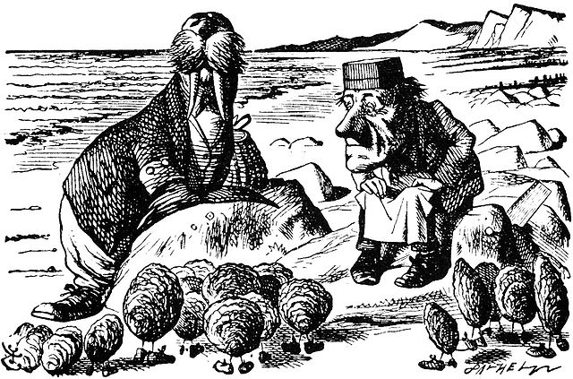

Title: The Walrus and the (Software) Carpenter
Date: 2022-09-18 10:00
Category: Python
Tags: python, walrus operator
Slug: the-walrus-and-the-software-carpenter
Authors: Grant Paton-Simpson
Summary: The Walrus operator risks encouraging buggy code by conflating assignment with evaluation. PHP stands as a warning as to where this can lead. There are few cases where the convenience of the Walrus operator outweigh its risks and even these are not clear-cut. From a When of Python view, the Walrus operator should be in Deprecated Python, or possibly Situational Python but with very few situations accepted. The Walrus will only very occasionally belong in production code.

What has your experience of the Walrus operator been? Do you agree with this post? Do you disagree? Please comment below.

The Walrus and the Carpenter - Lewis Carroll
============================================

> ...
*<br><br>The Walrus and the Carpenter
<br>    Were walking close at hand;
<br>They wept like anything to see
<br>    Such quantities of sand:
<br>If this were only cleared away,'
<br>    They said, it would be grand!'
<br>...
<br><br>Lewis Carroll - Through the Looking Glass*



The Walrus
==========

The Walrus operator is an assignment expression. Normally we assign values to names with the syntax `name = value` e.g. `fname = 'Zac'`. The Walrus operator allows us to perform assignment as an inline expression within another statement. For example, instead of:

```python
fname = 'Zac'
print(fname)
```
we can save a line by writing:

```python
print(f_name := 'Zac')
```

The Software Carpenter
======================

"Software Carpenter" in this post means a skilled Software Engineer - someone who understands the craft of software development[ref]Apologies if this is confusing to anyone. I am aware that the emphasis in [Software Carpentry](https://www.software.ac.uk/programmes-events/carpentries/software-carpentry) is on more basic skills but the [Lewis Carroll reference](https://www.poetryfoundation.org/poems/43914/the-walrus-and-the-carpenter-56d222cbc80a9) was too good to pass up.[/ref].

As an analogy I've built some very basic structures in my garage out of left-over pieces of timber.


They solve a practical need but would make a woodwork teacher cry. A skilled carpenter would build them much better.


In the software world, there is a similar distinction to be made between hacking together code and being a Software Carpenter.

A Software Carpenter will care about the following:

Readability and Maintainability
-------------------------------

Apart from throwaway code we need to care about readability and maintainability. In addition to unit testing and type hinting the best way of preventing bugs is to make code easily intelligible. This is especially important in projects which run for a long time and involve lots of different coders. And if code is mission critical or "enterprise" then it is especially important that code is written with readability as a high priority.

Clever Coder not "Clever" Code
------------------------------

Writing the simplest, most readable code possible is not easy. But that is the goal for a Software Carpenter. It can be fun to make the most dense, cryptic code possible - see [Code Golf](https://code.golf/). But we should never do this in production code i.e. code that matters. "Clever" code is a breeding ground for bugs.

Walrus Examples - Simple, Readable Code?
========================================

I recently asked for example code that demonstrated the value of the Walrus operator. The following was received:

```python
if ( transaction_type := retrieve( transaction ).type ) == "balance":
    show_balance()
elif transaction_type == "deposit":
    add_balance()
elif transaction_type == "withdrawal":
    decrease_balance()
else:
    raise TransactionException( transaction_type...doesn't make sense )
```

But avoiding the Walrus operator only adds one line (as was acknowledged up-front by the contributor) - namely:

```python
transaction_type = retrieve( transaction ).type
```

Using Python without the Walrus operator also simplifies the first condition clause. Instead of:

```python
if ( transaction_type := retrieve( transaction ).type ) == "balance":
```

we have:

```python
if transaction_type == "balance":
```

So not a very compelling use case there.

Another example was discussed in [Walrus Hunting with StrEnum](https://when-of-python.github.io/blog/walrus-hunting-with-strenum.html). In that case StrEnum seems a better solution. The person suggesting the code agreed but said the example helped the Walrus operator click for them. Fair enough, but the search for a genuinely useful use case continues.

Another developer suggested a good use case for the Walrus operator was[ref]The example has been altered to avoid using the keywoprd `list` as a variable name[/ref]:

```python
filtered_list = [res for item in items if (res := slow(item))]
```

which seemed more persuasive. The `slow` function is only called once per item. The non-Walrus, non-comprehension alternative is:

```python
filtered_list = []
for item in items:
    res = slow(item)
    if res:
        filtered_list.append(res)
```

which I have mixed feelings about. It *is* a lot longer. But its meaning is so plain it is less likely to contain bugs.

In balance, perhaps, a Walrus operator is a good option in such a case. It is both elegant and efficient. This use case is arguably the most persuasive of those presented in [Should You Be Using Python’s Walrus Operator? (Yes. And Here’s Why)](https://scribe.rip/should-you-be-using-pythons-walrus-operator-yes-and-here-s-why-36297be16907).

But is a single use case of uncertain value enough to recommend teaching the Walrus operator to beginners? PHP is a language which has blended assignment and evaluation with often [mind-boggling results](https://www.php.net/manual/en/language.operators.logical.php) - it is arguably a warning against this sort of "cleverness". Even an article promoting use of the Walrus operator ([Should You Be Using Python’s Walrus Operator? (Yes. And Here’s Why)](https://scribe.rip/should-you-be-using-pythons-walrus-operator-yes-and-here-s-why-36297be16907)) acknowledges that the Walrus operator can be abused and it provides a useful section on "Gotchas and Limitations". If we want to shrink Common Python then tightly restricting the use of the Walrus operator is probably a good idea. Maybe it should be in Situational Python with a recommendation to limit usage to comprehensions.

Current Verdict
===============

Until some compelling use cases for the Walrus appear we should probably discourage its widespread use in a When of Python. Mixing assignment and evaluation is a risky exercise and it would be better to invest energy understanding other safer and more useful language features or patterns instead. The one exception might be the use of the operator to avoid calling functions twice in comprehensions. The risks of this usage might be diminished if it became an idiomatic option (much the same way we often use lambdas when sorting). But generally speaking it might be best if Software Carpenters minimise contact with the Walrus:

> ...
*<br><br>It seems a shame,' the Walrus said,
<br>      To play them such a trick,
<br>After we've brought them out so far,
<br>      And made them trot so quick!'
<br>...*
